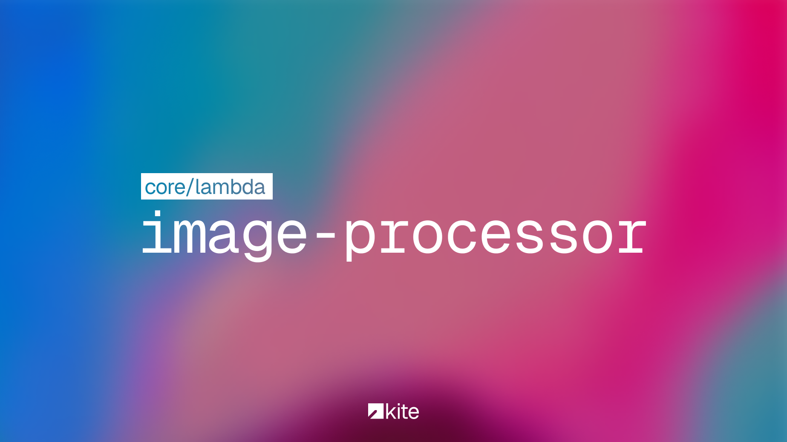

# Kite Image Processor &middot; [](https://github.com/stratocanvas/kiteapp-image-transformation/actions/workflows/aws.yml)

Kite 서비스용 이미지 처리 Lambda


## 기능
- [x] 이미지에서 캐릭터 얼굴 인식하여 인식된 얼굴 중심으로 크롭
- [x] 8192px 초과 이미지에 대해 분할 생성
- [x] 이미지에서 주요 색상 추출하여 파일명에 반영
- [ ] 사용자 지정 워터마크 적용

## 사용 라이브러리
- [onnxruntime-node](https://www.npmjs.com/package/onnxruntime-node): 객체 탐지 추론
- [sharp](https://www.npmjs.com/package/sharp): 이미지 처리
- [@stratocanvas/easy-ort](https://www.npmjs.com/package/@stratocanvas/easy-ort): ONNX runtime용 wrapper
- [node-vibrant](https://www.npmjs.com/package/node-vibrant): 주요 색상 추출

## 사용 모델

- [deepghs/anime_head_detection](https://huggingface.co/deepghs/anime_head_detection) `1.5n`

## AWS Layer 생성
> [!IMPORTANT]
> 이 Lambda는 Node.js 20 x86 환경에서 구동됩니다.

1. 다음 명령어 실행
```shell
npm install --cpu=x64 --os=linux --libc=glibc
```
2. `@img`와 `onnxruntime-node/bin`에서 linux x86 환경 외 나머지 파일 삭제
3. `nodejs/node20/node_modules` 폴더 압축
4. 압축 파일 S3에 업로드 후 Layer 지정

## 배포
- `main` branch에 커밋하면 Github Actions를 통해 자동으로 배포됩니다.

## TODO

- [ ] 처리 속도 개선
- [ ] Layer 배포 자동화 구축
